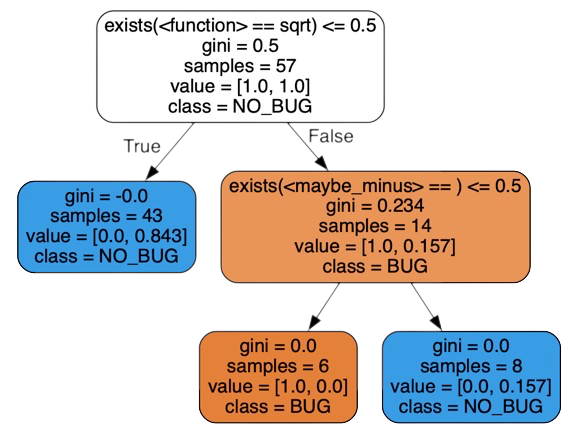

[](https://github.com/martineberlein/alhazen-py/actions/workflows/test_alhazen.yml)
&nbsp;


# alhazen-py

This repository contains a complete python implementation of the debugging tool **Alhazen**,
initially proposed by Kampmann et al. [[KHZ2020](https://dl.acm.org/doi/abs/10.1145/3368089.3409687)].
With this reimplementation we not only provide a concise and fast version of **Alhazen**,
we also include more machine learning models to explain the circumstances of failing programs.

### How to use _Alhazen_

To illustrate _Alhazen_’s capabilities, we start with a quick motivating example. First, let us introduce our program under test: The Calculator.

```python
import math

def arith_eval(inp) -> float:
    return eval(
        str(inp), {"sqrt": math.sqrt, "sin": math.sin, "cos": math.cos, "tan": math.tan}
    )
```

This infamous program accepts arithmetic equations, trigonometric functions and allows us to calculate the square root.
To help us determine faulty behavior, i.e., a crash, we implement an evaluation function

```python 
from alhazen.oracle import OracleResult

def prop(inp: str) -> OracleResult:
    try:
        arith_eval(inp)
        return OracleResult.NO_BUG
    except ValueError:
        return OracleResult.BUG
    return OracleResult.UNDEF
``` 

that takes an input file and returns whether a bug occurred during the evaluation of the mathematical equations (`BUG=True`, `NO_BUG=False`). 
We can now test the calculator with some sample inputs:

```python
inputs = ['cos(10)', 'sqrt(28367)', 'tan(-12)', 'sqrt(-3)']
print([(x, prop(x)) for x in inputs])
```

The output looks like this:

```
[('cos(10)', OracleResult.NO_BUG),
 ('sqrt(28367)', OracleResult.NO_BUG),
 ('tan(-12)', OracleResult.NO_BUG),
 ('sqrt(-3)', OracleResult.BUG)]
```

We see that `sqrt(-3)` results in the failure of our calculator program.
We can now use **Alhazen** to learn the root causes of the program's failure.

First, we need to define the input format of the calculator with a grammar:
```python
import string

grammar = {
    "<start>": ["<arith_expr>"],
    "<arith_expr>": ["<function>(<number>)"],
    "<function>": ["sqrt", "sin", "cos", "tan"],
    "<number>": ["<maybe_minus><onenine><maybe_digits>"],
    "<maybe_minus>": ["", "-"],
    "<onenine>": [str(num) for num in range(1, 10)],
    "<digit>": list(string.digits),
    "<maybe_digits>": ["", "<digits>"],
    "<digits>": ["<digit>", "<digit><digits>"],
}
```

Then, we can call **Alhazen** with the grammar, some sample inputs, and the evaluation function (program under test).

```python
from alhazen import Alhazen

alhazen = Alhazen(
    initial_inputs=inputs,
    grammar=grammar,
    evaluation_function=prop,
)
trees = alhazen.run()
```

By default, **Alhazen** will do _10_ iterations of its refinement process.
Finally, **Alhazen** returns the learned decision tree that describes the failure-inducing inputs.

For our calculator, the learned decision tree looks something like this:



We see that the failure occurs whenever we use the _sqrt(x)_ function and the number x has a negative sign!

## Using Alhazen from the command line (CLI)

Alhazen-py offers a minimal CLI tool. It expects a python-file where the needed data and code is supplied (e.g. as in `src/alhazen_formalizations/calculator.py`).

```shell
alhazen [...] your_program.py

# how to use the calculator example
alhazen src/alhazen_formalizations/calculator.py -e=prop -g=grammar -i=initial_inputs

# if you use the default names, you can omit them from the command
alhazen src/alhazen_formalizations/calculator.py -e=prop
```

Currently, the following Alhazen attributes are supported as parameters for the CLI:

<ul>
<li>initials_inputs</li>
<li>grammar</li>
<li>evaluation_function</li>
</ul>

### Specifying your output and getting help

By default, the CLI will print out result to stdout, with you being able to specify the output format:

```shell
# use the sklearn.tree.export_text() text representation
alhazen your_program.py -F=0

# use the sklearn.tree.export_graphviz() dot model representation
alhazen your_program.py --format=1
```

For further visualization you can for example pipe the output to `dot` and get an SVG (prerequisite: `graphviz`):
```shell
# create a svg of the tree by piping alhazens output to dot
alhazen src/alhazen_formalizations/calculator.py -e=prop | dot -Tsvg > output.svg
```

Miscellaneous:
```shell
# If you need help, check the help page
alhazen --help

# You can increase output verbosity with -v or --verbosity
alhazen -v ...
```

## Project Structure

In this repository, you find:

- the _reimplementation_ and [source code](./src/alhazen) of **Alhazen-py**, and
- a complete introduction ([jupyter-notebook](./notebooks/guide)) on how to use **Alhazen-py** and how you can add your own _Learners_ and _Generators_.


## Install, Development, Testing, Build

### Install
If all external dependencies are available, a simple pip install alhazen-py suffices.
We recommend installing **alhazen-py** inside a virtual environment (virtualenv):

```
python3.10 -m venv venv
source venv/bin/activate

pip install --upgrade pip
pip install alhazen-py

# check if alhazen was installed correctly
alhazen --version
```

Now, the alhazen command should be available on the command line within the virtual environment.

### Development and Testing

For development, we recommend using **alhazen-py** inside a virtual environment (virtualenv).
By thing the following steps in a standard shell (bash), one can run the Alhazen tests:

```
git clone https://github.com/martineberlein/alhazen-py.git
cd alhazen-py/

python3.10 -m venv venv
source venv/bin/activate

pip install --upgrade pip

# Run tests
pip install -e .[dev]
python3 -m pytest
```

### Build

**alhazen-py** is build locally as follows:

```
git clone https://github.com/martineberlein/alhazen-py.git
cd alhazen-py/

python3.10 -m venv venv
source venv/bin/activate

pip install --upgrade pip
pip install --upgrade build
python3 -m build
```

Then, you will find the built wheel (*.whl) in the dist/ directory.

## Contributors

The initial idea for writing the guide was to explain to our students at Humboldt-Universität Zu Berlin how to use _Alhazen_ to determine the failure circumstances of a program.
The original notebooks were a joint project with my colleague [Hoang Lam Nguyen](https://www.informatik.hu-berlin.de/en/Members/hoang-lam-nguyen) from Humboldt-Universität Zu Berlin.
